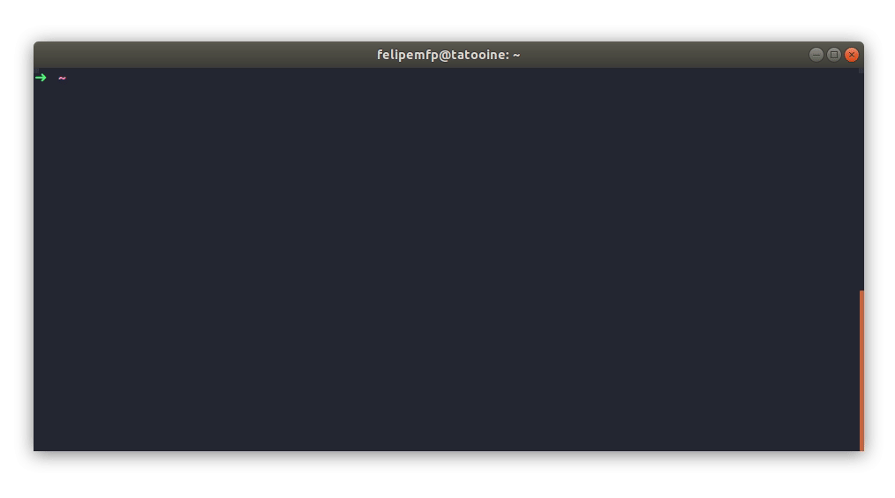

# 🇧🇷 sinonimos

Find synonyms without leaving your terminal




## Installing

Run this command to download the latest version of `sinonimos`:

```bash
sudo curl -L "https://github.com/felipemfp/sinonimos-cli/releases/download/v0.2.0/sinonimos" -o /usr/local/bin/sinonimos
```

Apply executable permissions to the binary:

```bash
sudo chmod +x /usr/local/bin/sinonimos
```

Now you're ready to use `sinonimos`

```bash
sinonimos --help
```

## Hacking into `sinonimos`

These instructions will get you a copy of the project up and running on your local machine for development.

### Prerequisites

What things you need to start hacking:

* [go](https://golang.org/doc/install)
* [golang/dep](https://github.com/golang/dep/blob/master/docs/installation.md)

### Getting started

First [fork](https://guides.github.com/activities/forking/) and clone the project to your machine:

```
git clone https://github.com/{your-username}/sinonimos-cli.git
```

Then install the dependencies:

```
cd sinonimos-cli
make dep-ensure
```

Now you're ready to go.

> See `Makefile` for useful development scripts, for example:
> ```
> make run WORD=camisa
> ``` 
> It'll run the project and try to find synonyms for "camisa".


## Built With

* [mow.cli](https://github.com/jawher/mow.cli)
* [scrape](https://github.com/yhat/scrape)

## Contributing

Please feel free for submitting pull requests to us.

## Versioning

We use [SemVer](http://semver.org/) for versioning. For the versions available, see the [tags on this repository](https://github.com/felipemfp/sinonimos-cli/tags). 

## Authors

* **Felipe Pontes** - *Initial work* - [felipemfp](https://github.com/felipemfp)

See also the list of [contributors](https://github.com/felipemfp/sinonimos-cli/contributors) who participated in this project.

## License

This project is licensed under the MIT License - see the [LICENSE](LICENSE) file for details
